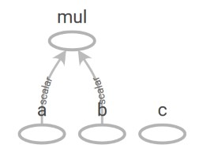
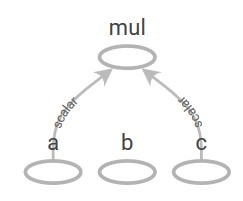

# 如何在建好TF图后修改图

网上大部分教程都说tensorflow的图建好后是不能修改的，但是实际上是可以的。

## Operation._update_input()函数

```python
op._update_input(i, new_tensor)
```

此函数的作用是将op的第i个输入变成new_tensor。

下面的例子是用该函数将mul op的输入从b变成c。
```python
import tensorflow as tf
import os

def SaveGraph(tb_dir, sess):
    if not os.path.exists(tb_dir):
    os.makedirs(tb_dir)
    g = sess.graph
    writer = tf.summary.FileWriter(tb_dir)
    writer.add_graph(g)
  
    
a = tf.placeholder(shape=[], dtype=tf.float32, name='a')
b = tf.placeholder(shape=[], dtype=tf.float32, name='b')
c = tf.placeholder(shape=[], dtype=tf.float32, name='c')

#build graph  
d = a*b

# save graph
sess = tf.Session()
SaveGraph('tensorboard/before/', sess)

# reroute operation mul
op = b.consumers()[0]#<op here is the mul operation of d>
op._update_input(1, c)#<update the first input of op with c>

# save new graph
SaveGraph('tensorboard/after/', sess)
```

在图建好后，tensorboard中的图如下所示：


; (https://github.com/xiaoke0515/xiaoke0515.github.io/blob/master/content/Tensorflow/1-figure_before.jpg)

在修改图时，首先用consumers函数求b节点的所有下一级节点，即mul节点。随后用op._update_input()函数来将mul的第1个输入从b节点变成c节点。修改后图如下所示：


; (https://github.com/xiaoke0515/xiaoke0515.github.io/blob/master/content/Tensorflow/1-figure_after.jpg)

这样，mul的输入从b节点变成了c节点。

## 在某个节点后插入op

这个是在看tensorflow.contrib.quantize模块的create_training_graph函数代码后学会的。实现了个简单的InsertOP函数来完成这个功能。

```python
def InsertOP(in_tensor, out_tensor, exclude_consumers):
    consumers = in_tensor.consumers()
    for con in consumers:
        if con in exclude_consumers:
            continue
        for i, inp in enumerate(con.inputs):
            if inp is in_tensor:
                con._update_input(i, out_tensor)
    return
```

参数：
* in_tensor：在此tensor后插入op。
* out_tensor：插入的op的输出的tensor。
* exclude_consumers：是一个op的列表，表示in_tensor的所有consumer中，不希望插入out_tensor的。

用法：

首先，定义一个要插入的op：
```python
def f(in_tensor):
    out_tensor = NewOP(in_tensor)
    exclude_consumers = ...
    return out_tensor, exclude_consumers
```
它输出两个变量：
* out_tensor：NewOP输出的tensor。
* exclude_consumers：插入的NewOP给in_tensor带来的新的consumers，这是一个值得注意的地方。
如果NewOP是一个节点，则exclude_consumers=[NewOP]；
如果NewOP是一个子图，那么exclude_consumers则是NewOP子图中所有的in_tensor的consumer。
如果不把这些consumer排除，那么在InsertOP后计算图会形成环。

之后再用InsertOP函数插入NewOP。